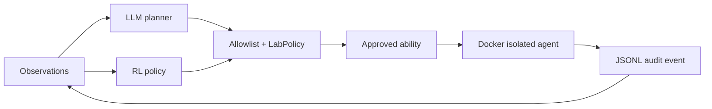

# Caldera Lab

격리된 AI Security Lab에서 CALDERA 스타일의 에이전트 실행을 연구하기 위한
제약형 adversary-emulation 프로젝트입니다. 원본 CALDERA의 능력/에이전트 개념을
참고하되, 이 프로젝트는 안전한 랩 안에서만 실행되도록 명령·네트워크·권한을 제한합니다.

## 현재 상태

MVP 구현이 완료되어 `main` 브랜치에 반영되어 있습니다. Docker 이미지 빌드와 non-root
격리 에이전트의 실제 2단계 실행을 확인했고, 테스트 6개와 Ruff 검사를 통과했습니다.
대시보드에는 7번째 프로젝트인 Caldera Lab으로 등록되어 있습니다.

다음 세션은 저장소의 [`HANDOFF.md`](HANDOFF.md)를 먼저 읽고 이어서 진행하세요. 현재
범위는 안전한 discovery 능력에 한정된 연구용 기반이며, 능력을 추가할 때는 catalog,
policy, Docker 경계, 감사 로그, 테스트를 함께 갱신해야 합니다.

## 핵심 차별점

- LLM planner: 관찰 로그를 보고 다음 단계를 제안하지만, 결과는 로컬 allowlist로 재검증합니다.
  요청은 catalog ID만 허용하는 JSON schema로 제약하며, 실패는 조용히 넘어가지 않고
  사유·재시도·지연·토큰 사용량을 `plan.created` / `plan.replanned` 이벤트에 남깁니다.
- RL policy: tabular Q-policy가 허용된 능력 중 다음 능력을 선택하고 보상으로 업데이트합니다.
  state는 "완료한 능력 집합 + 마지막 결과"로 추상화되어 실행 간 재방문·재사용되며,
  Q table은 `--q-table`(기본 `.runtime/q_table.json`)에 저장됩니다.
- 정보 이득 기반 보상: 종료 코드만 보지 않고 "새로 알아낸 사실"을 셉니다.
  `total = outcome + information_gain - cost`이며, 항마다 감사 로그에 남습니다.
  실행마다 변하는 출력은 catalog의 `volatile_patterns`로 능력별로 선언해 제외합니다.
- 실제 agent execution: 기본 실행기는 Docker 컨테이너이며 `network none`, read-only rootfs,
  `cap-drop ALL`, `no-new-privileges`, PID·메모리·CPU 제한, `--pull never`를 적용합니다.
- 감사 가능성: 계획, 승인, 실행 결과를 `run_id`가 붙은 JSONL 이벤트 로그에 append합니다.
- 에이전트 통신: loopback 전용 beacon 프로토콜. 명령이 아닌 ability ID만 전달하며,
  다중 에이전트 동시 접속과 beacon 이벤트 감사 로그를 지원합니다.
- 기본 능력은 `id`, `uname`, `ps`, read-only로 마운트한 `/workspace` 목록 수집뿐입니다.



## 실행

```bash
cd AI_Security_Lab/Caldera_Lab
python3 -m pip install -e ".[dev]"
docker build -t caldera-lab-agent:latest .
PYTHONPATH=src python3 -m caldera_lab run --executor docker --planner hybrid --steps 4
```

`--workspace <dir>`로 에이전트에 노출할 디렉터리를 지정합니다. 지정하지 않으면
`.runtime/workspace`를 사용하며, 어느 경우든 컨테이너 안에서는 read-only입니다.
학습 없이 실행하려면 `--no-q-table`을 씁니다. 저장된 table은 catalog 지문이 일치할 때만
로드되며, 불일치·손상·catalog 밖 action이 있으면 조용히 무시하고 빈 table로 시작합니다.

API 키가 없으면 `hybrid` planner는 결정론적 규칙 planner로 안전하게 fallback하며, 그
사유(`no_api_key`)가 감사 로그에 남습니다. LLM 사용 시 `OPENAI_API_KEY`, 선택적으로
`CALDERA_LLM_MODEL`과 `CALDERA_LLM_ENDPOINT`를 설정합니다. LLM은 명령을 만들 수 없고
catalog의 ID만 반환합니다. 엔드포인트는 운영자가 바꿀 수 있으므로 schema 제약과 별개로
로컬 allowlist가 최종 경계이며, 거부된 ID는 `rejected_ability_ids`로 기록됩니다.

fallback 사유는 `no_api_key`, `transport_error`, `http_<code>`, `invalid_json_body`,
`invalid_json_output`, `output_not_an_object`, `missing_ability_ids`, `no_allowlisted_ids`,
`no_text_in_response`입니다.

개발 중 Docker 없이 흐름만 확인하려면:

```bash
make run                         # dry-run
PYTHONPATH=src python3 -m caldera_lab run --executor local --allow-local --steps 2
```

에이전트 통신 계층을 통해 실행하려면:

```bash
PYTHONPATH=src python3 -m caldera_lab serve --executor docker --steps 4 --agents 3
```

beacon 서버는 `127.0.0.1`에만 바인드하며(다른 주소는 거부), 실행마다 새 토큰을 발급하고
저장하지 않습니다. **서버는 명령 문자열을 보내지 않고 catalog의 ability ID만 보냅니다.**
에이전트는 그 ID를 자신의 로컬 catalog에서 해석하고 정책 검증을 다시 통과시킨 뒤 실행합니다.
따라서 서버가 장악되어도 랩에 새로운 명령을 주입할 수 없습니다 — LLM planner와 동일한 경계입니다.

beacon을 쓰는 주체는 컨테이너가 아니라 **랩 측 supervisor 프로세스**입니다. 컨테이너 안에서는
소켓이 전혀 필요 없으므로 `--network none`이 그대로 유지됩니다.

`--agents N`으로 여러 에이전트를 동시에 붙일 수 있습니다. 큐는 락 아래에서 분배되므로 같은
능력이 두 에이전트에 배정되지 않습니다. `agent.registered` / `agent.tasked` / `agent.reported`
이벤트가 `run_id`와 함께 감사 로그에 append되며, `report`가 이를 집계합니다.

실행 결과를 요약하려면:

```bash
PYTHONPATH=src python3 -m caldera_lab report --log .runtime/run.jsonl
PYTHONPATH=src python3 -m caldera_lab report --json    # 기계 판독용
```

`report`는 감사 로그를 run 단위로 집계하고 catalog의 `technique` 필드로 MITRE ATT&CK
커버리지를 만듭니다. 한 번도 성공하지 못한 technique은 `!`로 표시되며, planner fallback 사유와
allowlist가 거부한 ID 목록도 함께 보여줍니다.

`local` 실행기는 개발 전용이며 기본값이 아닙니다. 실제 랩 실행은 Docker executor를 사용하세요.

베이스 이미지는 digest로 고정되어 있습니다. 갱신 시 CI의 `docker-smoke` 잡을 다시 통과시켜야
합니다. 안전 경계와 능력 추가 절차는 [`SECURITY.md`](SECURITY.md)를 따르세요.

### 변동성 출력 정규화

정보 이득은 stdout 라인 단위로 중복을 판별하므로, 실행마다 바뀌는 출력(`uname -a`의 컨테이너
hostname, `ps`의 CPU·시각 컬럼)은 새 정보가 아닌데도 novel로 집계될 수 있습니다. 이를
catalog의 `volatile_patterns`로 **능력별로 선언**해 해결합니다.

```json
{
  "id": "collect-system-info",
  "command": ["uname", "-a"],
  "volatile_patterns": ["\\b[0-9a-f]{12}\\b"]
}
```

일치하는 부분은 `<volatile>`로 치환한 뒤 비교합니다. 패턴은 선언 순서대로 적용되므로,
뒤 패턴이 지울 문맥에 의존하는 패턴을 먼저 두어야 합니다(`ps`의 CPU 컬럼은 뒤따르는 시각으로
식별하므로 시각 패턴보다 앞에 옵니다). 전역 휴리스틱으로 숫자를 일괄 치환하지 않는 이유는
`uid=65534` 같은 실제 발견까지 지워지기 때문입니다. 잘못된 정규식은 catalog 로드 시점에
거부됩니다.

## 안전 경계

- catalog에 없는 능력 ID와 임의 shell 문자열은 거부합니다.
- 기본 정책은 low-risk 능력, 최대 8단계, 단계별 timeout, 네트워크 비활성입니다.
- `requires_network` 능력은 정책이 네트워크를 허용하지 않는 한 실행되지 않습니다.
- `LabPolicy(approved_abilities=...)`로 catalog보다 좁은 승인 집합을 강제할 수 있습니다.
- 컨테이너는 read-only rootfs와 capability 제거로 실행됩니다.
- beacon 서버는 loopback에만 바인드하고, 토큰 없는 요청과 catalog 밖 ability를 거부합니다.
- 이 저장소는 인터넷 스캔, 자격 증명 수집, 지속성 설치, 임의 파일 변경 능력을 제공하지 않습니다.
- 반드시 소유하거나 명시적으로 허가된 격리 랩에서만 사용하세요.

## 품질

```bash
make check
```

CI는 두 개의 잡으로 구성됩니다. `quality`는 Python 3.10/3.12에서 lint와 테스트를 돌리고,
`docker-smoke`는 이미지를 빌드해 4개 능력을 실제 컨테이너에서 실행한 뒤
`.github/scripts/check_smoke.py`로 감사 로그를 검증합니다. 이 검사는 종료 코드만 보지 않고,
`/workspace`가 실제로 마운트되어 파일이 나열되었는지와 모든 실행의 `isolation`이 `docker`인지를
확인합니다. 별도로 `/workspace` 쓰기가 거부되는지도 검사합니다.

현재 테스트는 catalog 검증, planner fallback, LLM이 catalog 밖 ID를 반환할 때의 거부,
CLI의 `--allow-local` 게이트, 정책의 네트워크·승인 집합 거부, 감사 로그 append와 `run_id`
분리, RL state 추상화·Q table 왕복·손상된 table 거부·시드 재현성, 보상의 정보 이득·중복
감점·시간 비용 상한, LLM planner의 schema 제약·재시도·fallback 사유 기록, local executor를
검증합니다. 

최근 검증 결과:

```text
ruff check .       -> All checks passed
pytest             -> 74 passed
Docker execution   -> 4/4 abilities succeeded as uid=65534(nobody)
Workspace mount    -> read-only enforced (touch -> Read-only file system)
RL state space     -> 633 -> 31 states (도달 가능 기준), 8회 실행 내내 4개 항목 재방문
Reward             -> 최초 실행 1.24, 동일 능력 반복 시 0.24 (4개 능력 모두 정보 이득 0.0)
Docker smoke       -> 4 executions, 0 failures (digest 고정 이미지 기준)
Beacon             -> 127.0.0.1 전용 바인드, 4/4 실행 (컨테이너는 --network none 유지)
Multi-agent        -> 3 에이전트 동시 실행, 중복 배정 0건, 14 beacon 이벤트 기록
GitHub Actions     -> success (quality 3.10/3.12 + docker-smoke)
```

## 구조

```text
Caldera_Lab/
├── SECURITY.md                  # 안전 경계와 능력 추가 절차
├── .github/scripts/check_smoke.py  # CI 감사 로그 검증
├── catalog/abilities.json       # 허용된 능력 선언
├── src/caldera_lab/catalog.py   # catalog parser
├── src/caldera_lab/planner.py   # rule/LLM planner
├── src/caldera_lab/rl.py        # tabular Q policy + JSON 영속화
├── src/caldera_lab/reward.py    # 정보 이득 기반 보상
├── src/caldera_lab/report.py    # 감사 로그 집계 + ATT&CK 커버리지
├── src/caldera_lab/beacon.py    # loopback 전용 beacon 서버
├── src/caldera_lab/agent.py     # beacon 에이전트 (랩 측 supervisor)
├── src/caldera_lab/policy.py    # risk/network/승인 게이트
├── src/caldera_lab/executor.py  # Docker/local/dry-run executor
└── src/caldera_lab/orchestrator.py
```
