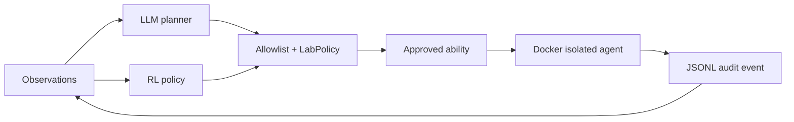

# Caldera Lab

격리된 AI Security Lab에서 CALDERA 스타일의 에이전트 실행을 연구하기 위한
제약형 adversary-emulation 프로젝트입니다. 원본 CALDERA의 능력/에이전트 개념을
참고하되, 이 프로젝트는 안전한 랩 안에서만 실행되도록 명령·네트워크·권한을 제한합니다.

## 현재 상태

MVP 구현이 완료되어 `main` 브랜치에 반영되어 있습니다. Docker 이미지 빌드와 non-root
격리 에이전트의 실제 2단계 실행을 확인했고, 테스트 6개와 Ruff 검사를 통과했습니다.
대시보드에는 7번째 프로젝트인 Caldera Lab으로 등록되어 있습니다.

다음 세션은 저장소의 [`HANDOFF.md`](HANDOFF.md)를 먼저 읽고 이어서 진행하세요. 현재
범위는 안전한 discovery 능력에 한정된 연구용 기반이며, 능력을 추가할 때는 catalog,
policy, Docker 경계, 감사 로그, 테스트를 함께 갱신해야 합니다.

## 핵심 차별점

- LLM planner: 관찰 로그를 보고 다음 단계를 제안하지만, 결과는 로컬 allowlist로 재검증합니다.
- RL policy: tabular Q-policy가 허용된 능력 중 다음 능력을 선택하고 보상으로 업데이트합니다.
- 실제 agent execution: 기본 실행기는 Docker 컨테이너이며 `network none`, read-only rootfs,
  `cap-drop ALL`, `no-new-privileges`, PID 제한을 적용합니다.
- 감사 가능성: 계획, 승인, 실행 결과를 JSONL 이벤트 로그로 남깁니다.
- 기본 능력은 `id`, `uname`, `ps`, 명시적으로 마운트한 `/workspace` 목록 수집뿐입니다.



## 실행

```bash
cd AI_Security_Lab/Caldera_Lab
python3 -m pip install -e ".[dev]"
docker build -t caldera-lab-agent:latest .
PYTHONPATH=src python3 -m caldera_lab run --executor docker --planner hybrid --steps 4
```

API 키가 없으면 `hybrid` planner는 결정론적 규칙 planner로 안전하게 fallback합니다.
LLM 사용 시 `OPENAI_API_KEY`, 선택적으로 `CALDERA_LLM_MODEL`과
`CALDERA_LLM_ENDPOINT`를 설정합니다. LLM은 명령을 만들 수 없고 catalog의 ID만 반환합니다.

개발 중 Docker 없이 흐름만 확인하려면:

```bash
make run                         # dry-run
PYTHONPATH=src python3 -m caldera_lab run --executor local --allow-local --steps 2
```

`local` 실행기는 개발 전용이며 기본값이 아닙니다. 실제 랩 실행은 Docker executor를 사용하세요.

## 안전 경계

- catalog에 없는 능력 ID와 임의 shell 문자열은 거부합니다.
- 기본 정책은 low-risk 능력, 최대 8단계, 단계별 timeout, 네트워크 비활성입니다.
- 컨테이너는 read-only rootfs와 capability 제거로 실행됩니다.
- 이 저장소는 인터넷 스캔, 자격 증명 수집, 지속성 설치, 임의 파일 변경 능력을 제공하지 않습니다.
- 반드시 소유하거나 명시적으로 허가된 격리 랩에서만 사용하세요.

## 품질

```bash
make check
```

현재 테스트는 catalog 검증, planner fallback, RL 실행 루프, JSONL 감사 로그,
local executor를 검증합니다. GitHub Actions는 Python 3.10/3.12에서 lint와 테스트를 실행합니다.

최근 검증 결과:

```text
ruff check .       -> All checks passed
pytest             -> 6 passed
Docker execution   -> 2 abilities succeeded as uid=65534(nobody)
GitHub Actions      -> success (Python 3.10 / 3.12)
```

## 구조

```text
Caldera_Lab/
├── catalog/abilities.json       # 허용된 능력 선언
├── src/caldera_lab/catalog.py   # catalog parser
├── src/caldera_lab/planner.py   # rule/LLM planner
├── src/caldera_lab/rl.py        # tabular Q policy
├── src/caldera_lab/executor.py  # Docker/local/dry-run executor
└── src/caldera_lab/orchestrator.py
```
